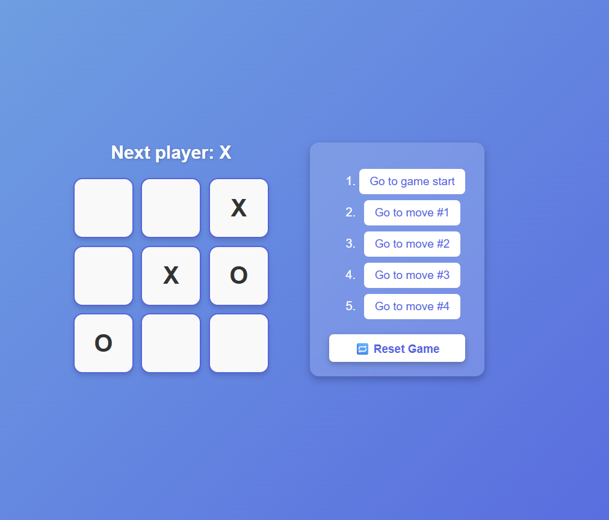

<!-- 🌟 PROJECT BANNER -->
<p align="center">
  
</p>

<!-- HEADER -->
<h1 align="center">🎮 Tic Tac Toe – React.js</h1>
<h3 align="center">
  A Simple & Interactive Game Built with React  
  Designed & Developed by 
  <span style="color:#8B5CF6;">Ahmed Moatz</span>
</h3>

---

## 🚀 Overview

**Tic-Tac-Toe---React.js** is a modern and interactive web game built using  
**React.js and JavaScript (ES6+)**.

This project demonstrates core React concepts like components, state management, props, and hooks in a clean and simple way.

It’s perfect for beginners who want to practice React fundamentals while building a real interactive project.

---

## 🧠 Features

- ❌⭕ Two-player mode (X vs O)  
- 🧠 Winner detection logic  
- 🤝 Draw detection  
- 🔄 Restart game functionality  
- ⚡ Instant UI updates using React state  
- 📱 Responsive design  

---

## 🛠️ Tech Stack

<p align="center">
  
</p>

---

## 🌐 Live Demo

**Play the game online**

<p align="center">
  <a href="https://ahmedmoatz1.github.io/Tic-tac-toe---React.js/" target="_blank">
    
  </a>
</p>

---

## ⚙️ How to Use

1. **Clone the repository**
   ```bash
   git clone https://github.com/Ahmedmoatz1/Tic-tac-toe---React.js.git
